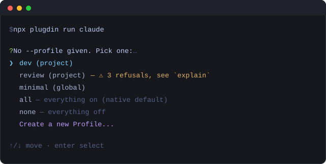
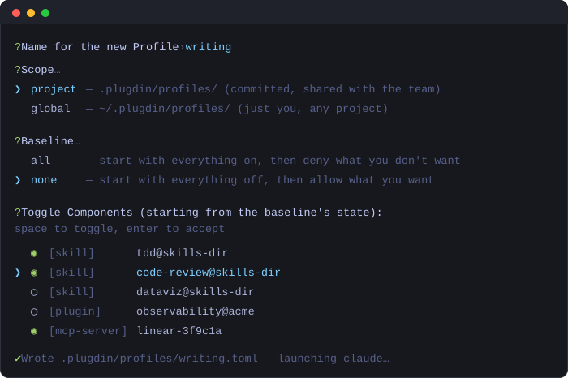

# plugdin

**Pick which skills, plugins, and MCP servers your coding agent sees. Per session, in any client.**

Every skill, plugin, and MCP server you install is loaded into *every* session, forever. A
dozen of them and your agent starts each task carrying tools it will never use: tokens spent
before you type anything, and a model choosing between fifty options when three were
relevant. Turning them off is worse: each client hides that switch somewhere different, and
some don't have one at all.

plugdin gives you named **Profiles** ("writing", "review", "dev") that say which
Components are active. Pick one at launch and it applies to that session only; your real
config is never edited. The same Profile works across Claude Code, Codex, Grok Build,
OpenCode, and Pi, so the set you trust travels with you instead of being rebuilt per client.

It selects; it doesn't install. Keep using `npx skills` / `npx plugins` to install things;
plugdin just decides what's awake today.

## Quick start

No install needed. Launch your agent through plugdin and it asks which Profile to use:

```bash
npx plugdin run claude
```



Pick one and your agent starts. Nothing to set up first: `all` and `none` are always there,
and you can build a real Profile the moment you want one.

Already know which you want? Name it and skip the menu:

```bash
npx plugdin run claude --profile writing
```

Everything after the client name passes straight through to the real binary, so your usual
flags keep working:

```bash
npx plugdin run claude --profile review -p "what changed on this branch?"
```

## Use with Claude Code

```bash
plugdin adopt                         # run once: shims skills so a Profile can turn them off
plugdin run claude --profile writing  # or: claude-code
plugdin run claude --profile writing -p "summarize this repo"
```

That first step exists only because Claude Code has no native per-skill filter: a skill has to
be Annotated before a Profile can hide it. It's idempotent, so running it again does nothing,
and `plugdin adopt --undo` removes the shims. Profiles that only turn skills *on* never need
it, and no other client does either.

## Use with Codex

```bash
plugdin run codex --profile writing
plugdin run codex --profile writing --model gpt-5.5
```

Works out of the box: skills are selected natively via `-c skills.config=[...]`. One caveat:
an MCP server already configured in Codex can't be turned off, so plugdin says so and leaves
it as your config has it rather than pretending otherwise.

## Use with Grok Build

```bash
plugdin run grok --profile writing "fix the failing test"    # or: grok-build
```

Grok isn't driven by flags, so plugdin launches it with a temporary `GROK_HOME`: symlinks
back into your real `~/.grok`, with only `config.toml` swapped for a generated one. Your real
config is untouched, and `plugdin explain` prints the generated file before you commit to it.

## Use with OpenCode

```bash
plugdin run opencode --profile writing
```

Launched with an inline `OPENCODE_CONFIG_CONTENT`, so again nothing on disk changes. Note that
OpenCode turns a skill off through its `skill` permission: the skill can't run, but its name
still appears in the model's catalog, because OpenCode has no per-skill discovery filter.

## Use with Pi

```bash
plugdin run pi --profile writing
```

Needs no config shim at all, because Pi's own `--no-skills` / `--skill` flags say everything a
Profile needs to say.

## Profiles

### Create one on the fly

Choose **Create a new Profile...** in the picker. It names the file, asks what to start from,
and hands you a checklist of everything installed on the machine:



The list starts pre-checked wherever your chosen baseline leaves each Component: everything
on for `all`, nothing for `none`. Space toggles, Enter accepts, and the file is written and
launched immediately. There's no separate save step.

### Or write the file by hand

A Profile is just TOML. The filename is its name:

```toml
# .plugdin/profiles/writing.toml
baseline = "none"                     # "all", "none", or another Profile to inherit
allow = ["tdd@skills-dir", "code-review@skills-dir"]
deny = []
```

- **`~/.plugdin/profiles/`**: global, available in every project.
- **`.plugdin/profiles/`**: project-scoped, meant to be committed and shared with the team.
  A project Profile replaces a global one of the same name outright; they never merge.

Set a default so a bare `plugdin run <client>` in a script picks it up:

```toml
# .plugdin/config.toml
default_profile = "writing"
```

## Checking what a Profile will do

```bash
plugdin explain writing    # exactly what every client would get; reads only, launches nothing
plugdin doctor             # typos in allow/deny, drifted Annotations, name collisions
plugdin adopt              # write the Claude Code skill shims (see above); --dry-run, --undo
```

`explain` is the one worth knowing: it prints every discovered Component and whether it's on,
the native args and generated config each client would receive, and anything that *can't* be
honored, before you launch instead of after. Full reference in
[docs/usage.md](./docs/usage.md).

## Install

`npx plugdin` needs no install. To keep it on your PATH:

```bash
npm install -g plugdin
```

## Development

```bash
npm install
npm run build      # src/ -> dist/, which package.json's bin points at
npm test           # vitest
npm run typecheck  # tsc, both src/ and test/

npx tsx src/cli.ts explain    # run from source without rebuilding
```

Tests that need real Client behavior mock `runClientCommand` (`src/util/exec.ts`) rather than
shelling out. The actual shapes of `claude plugin list --json` / `grok inspect --json` /
`opencode debug skill` etc. were captured live against this machine's real Client installs, and
are documented where each adapter parses them (`src/inventory/*.ts`) and in
`spikes/FINDINGS.md`.

Design docs: [CONTEXT.md](./CONTEXT.md) for the vocabulary, [docs/overview.md](./docs/overview.md)
for how the pieces fit, [docs/adr/](./docs/adr/) for why they fit that way.
